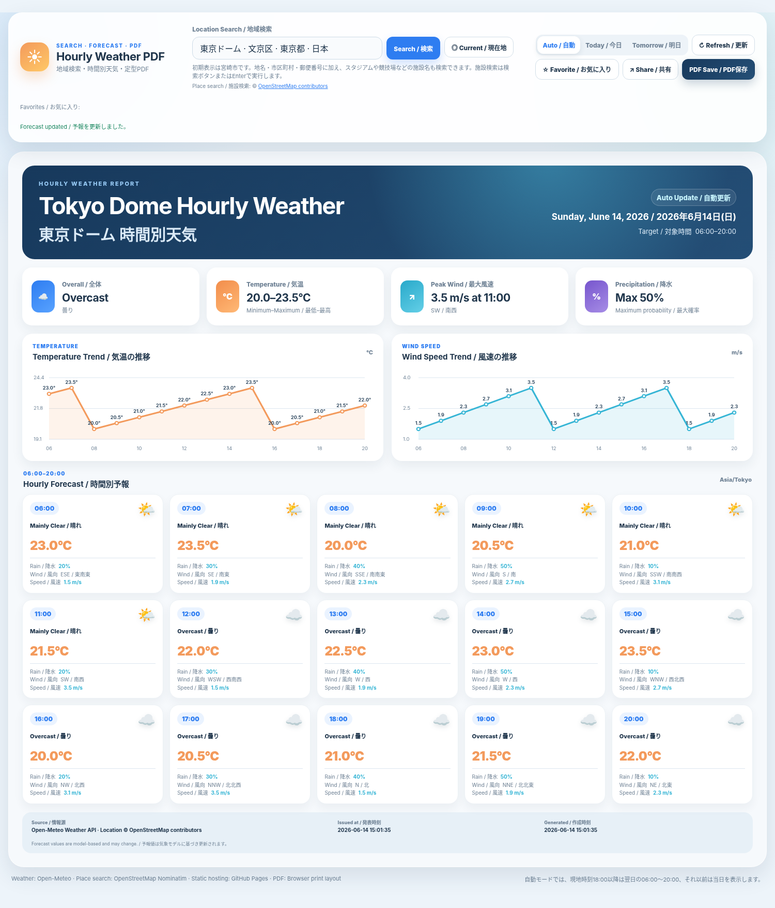

# Hourly Weather PDF / 時間別天気PDF

地域やスタジアムを検索し、06:00〜20:00の時間別予報を英日併記の固定レイアウトで表示し、A4横1ページのPDFとして保存できるGitHub Pages向けサイトです。




## 主な機能

- 初期表示は宮崎市
- 世界中の地名、市区町村、郵便番号を検索
- スタジアム、競技場、球場、アリーナなどの施設名を検索
- 06:00〜20:00の15時間を固定表示
- 天気、気温、降水確率、風向、風速を英日併記
- 気温と風速のグラフ
- 同一テンプレートによるA4横1ページPDF
- お気に入り地域をブラウザに保存
- URL共有
- 15分ごとの自動再取得
- 自動モード：現地時刻18:00以降は翌日、それ以前は当日
- GitHub ActionsによるPages公開
- GitHub Actionsによる定時PDF生成（初期値は宮崎市）

## データソース

- 地域・市区町村検索：Open-Meteo Geocoding API
- スタジアム・施設検索：OpenStreetMap Nominatim
- 天気予報：Open-Meteo Forecast API

APIキーは不要です。施設検索結果にはOpenStreetMapのクレジットを表示します。

### 施設検索の操作

入力中の候補表示は市区町村検索のみです。スタジアムや競技場を検索するときは、施設名を入力して **Search / 検索** を押すかEnterキーを押してください。

検索例：

```text
東京ドーム
国立競技場
みずほPayPayドーム福岡
エスコンフィールドHOKKAIDO
Wembley Stadium
Madison Square Garden
```

公開Nominatimサービスの利用ポリシーに合わせ、施設検索は利用者が明示的に実行した場合だけ送信し、結果をブラウザ内に7日間キャッシュします。同一アプリからのリクエストは最低1.1秒の間隔を空けます。アクセス規模が大きくなる場合は、`CONFIG.poiSearchEndpoint`を商用プロバイダーまたはセルフホストしたNominatimへ変更してください。

## GitHub Pagesへの公開

1. このフォルダの内容を新しいGitHubリポジトリへ追加します。
2. 既定ブランチ名を `main` にします。
3. GitHubの **Settings → Pages → Build and deployment → Source** を **GitHub Actions** に設定します。
4. `main` にpushすると `.github/workflows/pages.yml` が実行されます。
5. Actionsのデプロイ完了後、PagesのURLを開きます。

## ローカル実行

```bash
npm install
npm start
```

ブラウザで `http://127.0.0.1:4173` を開きます。

単純な静的サイトなので、Pythonでも確認できます。

```bash
python3 -m http.server 4173
```

## PDF保存

サイトの **PDF Save / PDF保存** を押し、ブラウザの印刷画面で「PDFに保存」を選びます。

推奨設定：

- 用紙：A4
- 向き：横
- 余白：なし、または既定
- 背景グラフィック：オン
- 拡大縮小：100%

印刷用CSSでレイアウト、配色、サマリーカード、グラフ、15枚の時間別カード、フッターを固定しています。

## ActionsでPDFを生成

`Generate Weather PDF` ワークフローは次の時刻に実行されます。

- 06:00 JST
- 12:00 JST
- 18:00 JST

自動モードでは、18:00以降は翌日の06:00〜20:00、それ以前は当日の06:00〜20:00を生成します。

手動実行では、地域名、緯度、経度、タイムゾーン、対象日モードを入力できます。生成されたPDFはGitHub ActionsのArtifactから取得できます。

初回のみローカルで次を実行し、`package-lock.json`をコミットしてください。

```bash
npm install
```

## 初期地域の変更

`app.js` の `CONFIG.defaultLocation` を編集します。

```js
const CONFIG = {
  defaultLocation: {
    name: "Miyazaki",
    nameJa: "宮崎市",
    latitude: 31.9077,
    longitude: 131.4202,
    timezone: "Asia/Tokyo"
  }
};
```

定時PDFの初期地域は `.github/workflows/generate-pdf.yml` の既定値も変更してください。

## URLパラメータ

選択地点はURLに保存されるため、そのまま共有できます。

```text
?lat=35.6762&lon=139.6503&name=Tokyo&nameJa=東京都&timezone=Asia/Tokyo&mode=auto
```

`mode` は `auto`、`today`、`tomorrow` のいずれかです。

## 注意事項

- 予報は気象モデルに基づくため、更新のたびに変わる場合があります。
- 「Issued at / 発表時刻」はAPI取得時刻として表示しています。
- GitHub Pagesは静的ホスティングのため、利用者が検索した地域をサーバー側の定時登録へ自動追加する機能はありません。
- 利用者は任意地域やスタジアムを検索し、その場で最新予報を表示・PDF保存できます。
- 公開Nominatimは大規模アクセスやクライアント側オートコンプリート用途には使用できません。このサイトでは施設検索を検索ボタン／Enterによる明示実行に限定しています。
